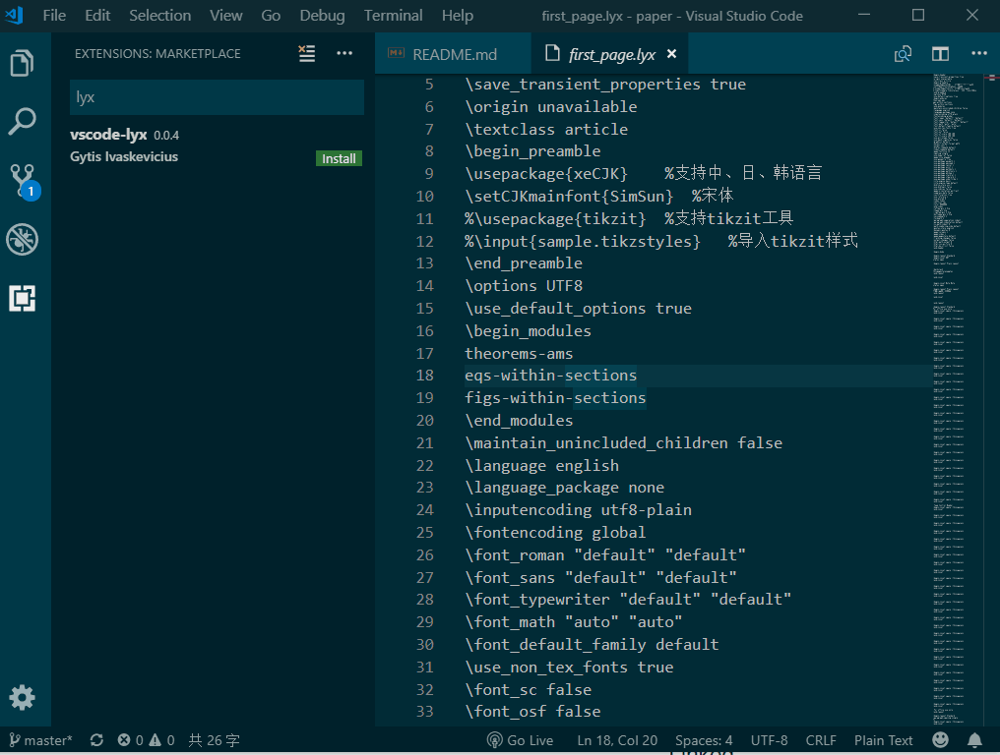
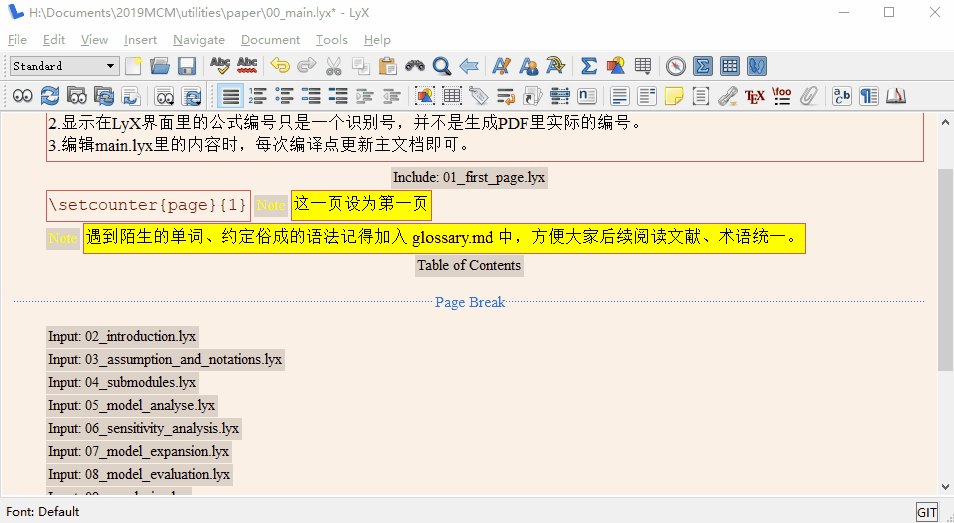
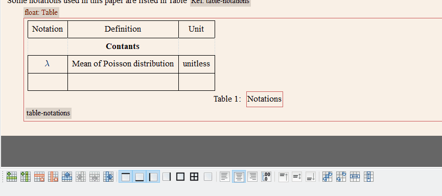

# mcm

mcm paper template for LyX.

## Project structure

```files
- _template.lyx 只设置了 Document 属性的模板，咱们所有文件都应该从这个模板开始
- 1911426.lyx 文档主入口，包含所有组件的引用，1911426 Control Number

- 01_first_page.lyx 首页，包括：标题、summary
- 02_...
- ... 子文档，文件名都是自解释的
- 10_appendices.lyx
```

## Glossary

See https://docs.qq.com/sheet/DTFJVWkJDbnRVYmtZ?tab=BB08J2

## Tips

<!-- 使用 vscode 为 `.lyx` 增加代码高亮和自动补全：

 -->

### All in one editor

保持所有子文档和 `main.lyx` 在同一个编辑窗口内，这样才可以在子文档内正确地引用 `main.lyx` 内面的 `.bib` 库文件，而且编辑的时候在子文档内 `section` 的标号也将会按照整体结构来。Demo 如下：



### Math shortcut

按 `Ctrl` + `M` 进入数学模式，可以写 TeX 语法的数学公式，按 `Tab` 键确认；并且无需保存子文档，直接在 `main.lyx` 内面使用 `Ctrl` + `R` 就可以编译所有子文档的改动。Demo 如下：



### Useful shortcuts

|           Shortcut           | Function |
| :--------------------------: | :------: |
| <kbd>Ctrl</kbd>+<kbd>R</kbd> |   View   |
| <kbd>Ctrl</kbd>+<kbd>M</kbd> | Math|
| <kbd>Alt</kbd>+<kbd>P</kbd>, <kbd>B</kbd> | Itemized list|
| <kbd>Alt</kbd>+<kbd>P</kbd>, <kbd>E</kbd> | Numbered list|
| <kbd>Alt</kbd>+<kbd>A</kbd>, <kbd>L/C/R</kbd> | Align Left/Center/Right|
