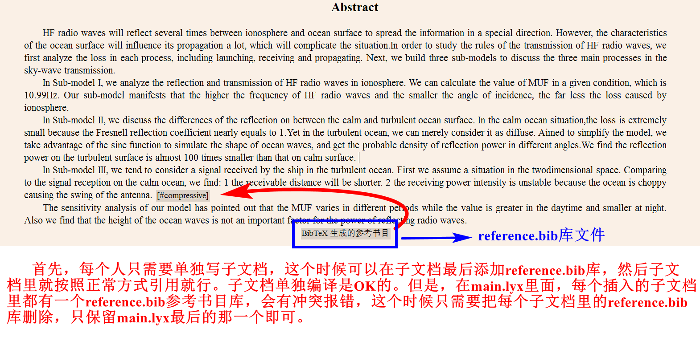

# mcm

mcm paper template for LyX.

## Project structure

```files
- 00_main.lyx 文档主入口，包含所有组件的引用

- 01_first_page.lyx 首页，包括：标题、summary
- 02_...
- ... 子文档，文件名都是自解释的
- 10_appendices.lyx
```

## Tips

使用 vscode 为 `.lyx` 增加代码高亮和自动补全：


可以在子页面中添加 `reference.bib` 的引用，便于在 LyX 中编辑时插入引用，最后合入 `main.lyx` 要进行删除：

